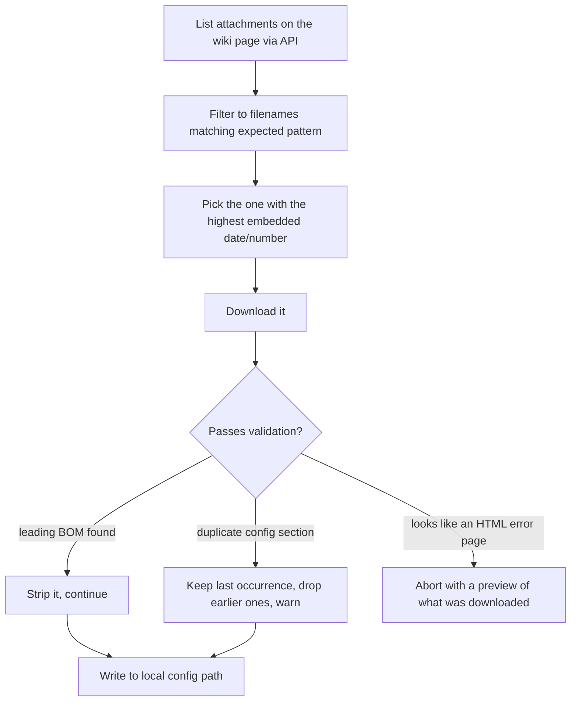
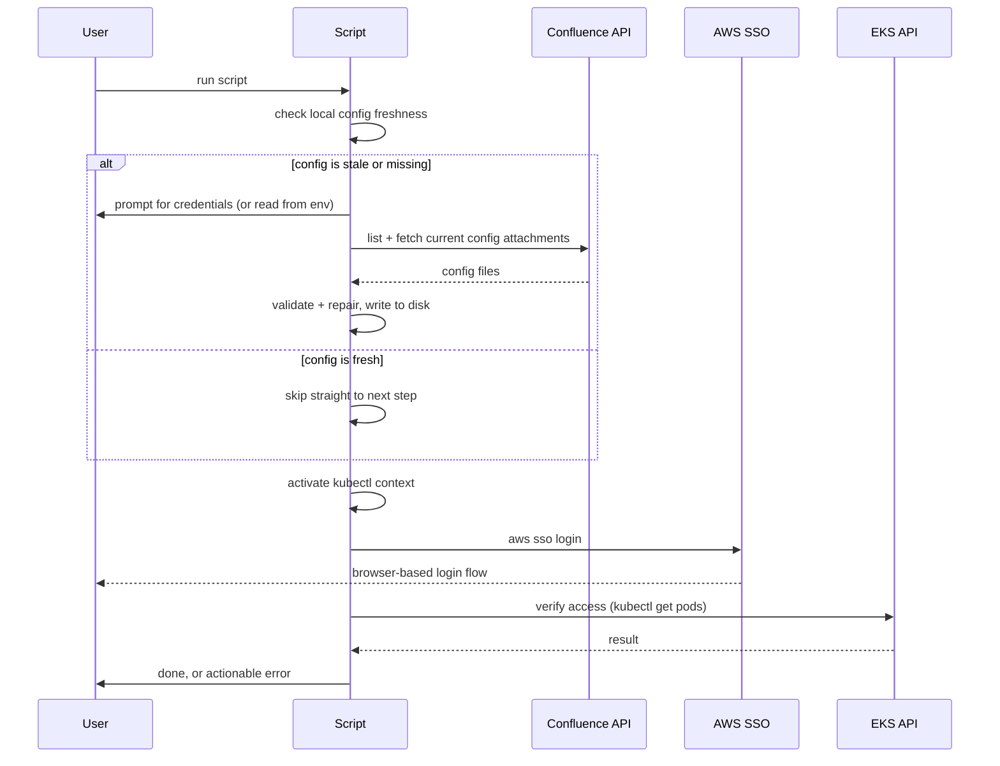

# Architecture Concepts: Kubernetes/AWS Access Setup Tool

This document describes the tool's architecture at a conceptual level — the components, data flow, and design decisions — without reproducing the proprietary implementation. It's a companion to the [case study](./case-study-k8s-onboarding.md), written for anyone interested in *how* the tool is put together rather than just the problem it solves.

## Goals that shaped the design

Before any component-level decisions, a few constraints drove almost everything else:

- **Single file, no dependencies beyond what macOS/Homebrew already provides.** The audience is Support agents, not engineers — anything requiring a build step, a package install, or cloning a repo with dependencies was off the table. It had to be one script someone could download and run.
- **Idempotent and safe to re-run.** Because the tool would be run repeatedly (daily re-authentication is a normal part of the underlying SSO setup), every step needed to be safe to run again without creating duplicate state, corrupting existing config, or requiring manual cleanup first.
- **Fail loud and specific, not silent and generic.** Given the audience wouldn't have the context to debug a bare stack trace, every failure path needed to end in a plain-language explanation and a concrete next action — not just a nonzero exit code.
- **Cheap for the common case, thorough for the first-time case.** First-time setup and "I need to re-authenticate today" are very different situations with very different acceptable costs — the architecture treats them differently rather than always paying the full cost.

## System context

The tool orchestrates four systems that don't otherwise know about each other:

```mermaid
flowchart LR
    User[Support agent's Mac]
    Brew[Homebrew]
    Wiki[Confluence page<br/>(dated config attachments)]
    SSO[AWS IAM Identity Center]
    EKS[EKS cluster API]

    User -- installs CLI tools via --> Brew
    User -- fetches current config from --> Wiki
    User -- authenticates via --> SSO
    User -- verifies access to --> EKS
    SSO -. issues short-lived credentials used by .-> EKS
```

None of these four systems were designed to work together — the tool's entire job is being the thing that understands how they relate and sequences the handoffs between them correctly.

## Component breakdown

**1. Argument parsing & versioning.** A minimal front door: recognizes a version flag, an explicit "force refresh" flag, and rejects anything else with a usage message. Kept deliberately small — this tool intentionally has almost no configuration surface, because every added flag is something a non-technical user has to understand.

**2. Environment bootstrap.** Installs the handful of CLI tools the rest of the script depends on (a cloud CLI, a Kubernetes CLI, a couple of small JSON/YAML utilities) via the OS package manager, but only after installing the package manager itself if it's missing. This layer also contains a diagnostic subcomponent that checks whether the current process's effective architecture matches the machine's real hardware — necessary because a correctly-installed, correctly-native tool can still fail to execute if the terminal session itself is running under a compatibility/emulation layer. This check exists specifically because that failure mode produces an error message with no obvious connection to its actual cause.

**3. Credential acquisition.** An interactive layer that collects a work email and an API token for the wiki system, with three properties layered on top of "just read two strings": masked input that still gives feedback that *something* was typed (rather than a blank, ambiguous prompt), an offer to open the token-generation page directly in a browser, and a full bypass via environment variables so the same code path works unattended (e.g., for testing) as well as interactively.

**4. Remote config retrieval.** The most involved component, structured as a small pipeline:



The key architectural decision here is treating the wiki page as an **unreliable data source**, not a trusted file server. "Latest" is derived from parsing a date out of the filename itself (matching the actual convention in use) rather than trusting API metadata fields, and every downloaded file is validated for known failure shapes *before* being written to a location another tool will read from — because by the time a downstream tool like a CLI's config parser fails, the actual cause is several steps removed and much harder to diagnose.

**5. Local state / caching layer.** Before attempting any of the above, the tool checks the modification time of the previously-downloaded config files. If they're recent enough, the entire credential-acquisition and remote-retrieval pipeline is skipped and the tool proceeds directly to session activation. This is what makes "re-authenticate today" cost seconds instead of minutes — the expensive, first-time-only work isn't repeated just because a *different*, cheap step (the SSO session) needs to happen again.

**6. Context activation.** Switches the local Kubernetes CLI's active context and triggers the cloud CLI's SSO login flow for the relevant profile. Comparatively simple, but positioned deliberately *after* config retrieval so it always operates on a config file that's already been validated.

**7. Verification.** A final check that access actually works, rather than ending the script the moment prior commands succeeded. This component went through the most iteration (see the [lessons learned](./lessons-learned.md) document) — its final form is intentionally the simplest version tried, after several more "sophisticated" versions failed to actually explain a real, reproducible discrepancy better than the simple one did.

**8. Progress reporting.** A thin, cross-cutting layer — a step counter wrapping the components above — that exists purely for the human on the other end. Architecturally trivial; behaviorally one of the highest-leverage pieces, since it's what turns "an opaque wall of terminal output" into "a process with a visible beginning, middle, and end."

## Data flow, end to end



## Design decisions worth calling out

- **Plain shell over a "real" language.** Given the single-file, zero-dependency constraint and a target platform that always has a POSIX shell but not necessarily a specific language runtime, shell was the only choice that didn't add a dependency the tool would otherwise need to install first.
- **Environment-variable overrides for every interactive prompt.** Every value the tool asks for interactively can also be supplied via environment variable. This wasn't for the primary audience — it's what made the tool's own components testable and reproducible during development, and it's a generally cheap pattern to build in from the start.
- **Recoverable vs. fatal validation failures are handled differently on purpose.** A byte-order-mark is a benign, well-understood artifact — the tool fixes it silently. A duplicated configuration section indicates an actual mistake in the source data — the tool fixes it too (recovery still beats blocking someone's access), but *loudly*, because leaving that fixed silently would let a real documentation problem persist unnoticed. A response that looks like an HTML error page is treated as fully fatal, because there's no safe assumption to make about *why* it doesn't look like the expected file.
- **The verification step's final architecture is the simplest one, not the most robust one.** Several more defensive versions were built and tested first. The lesson that shaped the final version — covered in more depth in the lessons-learned document — is that added robustness is only valuable if it's addressing the actual failure mode, and confirming that requires evidence, not just plausible-sounding theory.

## Extensibility

A few things this architecture makes straightforward to extend, if the tool's scope ever needed to grow:

- **Additional regions/clusters:** the context-activation step is a thin, isolated layer — adding a second target is a matter of adding another activation call, not restructuring the pipeline.
- **A different config source:** the retrieval pipeline's "list, filter, pick latest, download, validate" shape doesn't assume anything Confluence-specific except the API calls at the edges — swapping the source system means replacing those calls, not the pipeline logic.
- **Non-interactive/CI use:** already supported via the environment-variable overrides, but a `--non-interactive` mode that fails fast instead of prompting would be a small, additive change.
